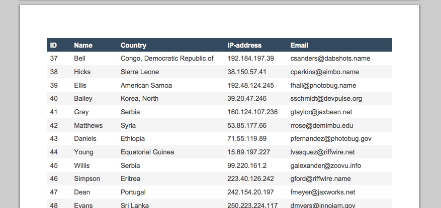
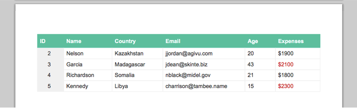

# AutoTable - Table plugin for jsPDF

[](https://gitter.im/someatoms/jsPDF-AutoTable?utm_source=badge&utm_medium=badge&utm_campaign=pr-badge&utm_content=badge)

**Generate PDF tables or lists with javascript**

Check out the [demo](https://someatoms.github.io/jsPDF-AutoTable/) to get an overview of what can be done with this plugin. I have used it for a lot of projects. Everything from startlists and resultslists for various sports to participanttables of business meetings and events. The goal is to support all kinds of tables and lists.

### Features
- Auto width (100% of page width or only as much as required)
- Multiple pages
- Custom headers and footers
- Multiple tables on the same page
- Custom styling
- Helper method to parse data from html table





See all sample pdf documents in `/samples`

### Install
- Download `jspdf.plugin.autotable.js` or install with bower  `bower install jspdf-autotable`
- Include jsPDF and the plugin

```html
<script src="bower_components/jspdf/dist/jspdf.debug.js"></script>
<script src="bower_components/jspdf-autotable/jspdf.plugin.autotable.js"></script>
```

### Install within a [Meteor project](http://meteor.com)

[Review the documentation on Atmosphere for the most recent details on this
package](https://atmospherejs.com/chipcastledotcom/jspdf-autotable).

    meteor add chipcastledotcom:jspdf-autotable

### Basic example

```javascript
var columns = [
    {title: "ID", key: "id"}, 
    {title: "Name", key: "name"}, 
    {title: "Country", key: "country"}, 
    {title: "Email", key: "email"}
];
var data = [
    {"id": 1, "name": "Shaw", "country": "Tanzania", "email": "abrown@avamba.info"},
    {"id": 2, "name": "Nelson", "country": "Kazakhstan", "email": "jjordan@agivu.com"},
    {"id": 3, "name": "Garcia", "country": "Madagascar", "email": "jdean@skinte.biz"},
    ...
];

var doc = new jsPDF('p', 'pt');
doc.autoTable(columns, data, {});
doc.save('table.pdf');
```

See more advanced examples in `/examples/examples.js` which is the source code for the [demo](https://someatoms.github.io/jsPDF-AutoTable/) documents.

### Default options

```javascript
var options = {
    padding: 3, // Horizontal cell padding
    fontSize: 12,
    lineHeight: 20,
    renderHeader: function (doc, pageNumber, settings) {}, // Called before every page
    renderFooter: function (doc, lastCellPos, pageNumber, settings) {}, // Called at the end of every page
    renderHeaderCell: function (x, y, width, height, key, value, settings) {
        doc.setFillColor(52, 73, 94); // Asphalt
        doc.setTextColor(255, 255, 255);
        doc.setFontStyle('bold');
        doc.rect(x, y, width, height, 'F');
        y += settings.lineHeight / 2 + doc.internal.getLineHeight() / 2 - 2.5;
        doc.text('' + value, x + settings.padding, y);
    },
    renderCell: function (x, y, width, height, key, value, row, settings) {
        doc.setFillColor(row % 2 === 0 ? 245 : 255);
        doc.rect(x, y, width, height, 'F');
        y += settings.lineHeight / 2 + doc.internal.getLineHeight() / 2 - 2.5;
        doc.text('' + value, x + settings.padding, y);
    },
    margins: { right: 40, left: 40, top: 50, bottom: 40 }, // How much space around the table
    startY: false // The start Y position on the first page. If set to false, top margin is used
    overflow: 'ellipsize', // false, ellipsize or linebreak (false passes the raw text to renderCell)
    overflowColumns: false, // Specify which colums that gets subjected to the overflow method chosen. false indicates all
    avoidPageSplit: false, // Avoid splitting table over multiple pages (starts drawing table on fresh page instead). Only relevant if startY option is set.
    extendWidth: true // If true, the table will span 100% of page width minus horizontal margins.
 };
```

All the options are used in one or more of the examples (`/examples/examples.js`) in the [demo](https://someatoms.github.io/jsPDF-AutoTable/) so be sure to check them out if in doubt.

### Other libraries
Below is a list of other plugins and libraries that I have tried. I felt that features were missing for gerating pdf tables and lists in all of them and therefore decided to build a new table plugin for jsPDF.

- [Included jsPDF table plugin](https://github.com/MrRio/jsPDF/blob/master/jspdf.plugin.cell.js)
- [jsPdfTablePlugin (jsPDF)](https://github.com/Prashanth-Nelli/jsPdfTablePlugin)
- [pdfmake (javascript)](https://github.com/bpampuch/pdfmake)
- [fpdf (php)](http://www.fpdf.org/)
- [pdfbox (java)](https://pdfbox.apache.org/) 

### Contributions and feature requests
If you would like any new features, feel free to post issues or make pull request.

Planned features:
- Support more units (now only supports pt)
- Add more overflow options (linebreak, hidden, center ellipsis)
- Columnspan and rowspan
- A wiki describing the options, api methods and different initalization formats
- Missing something? Let me know by posting an issue.