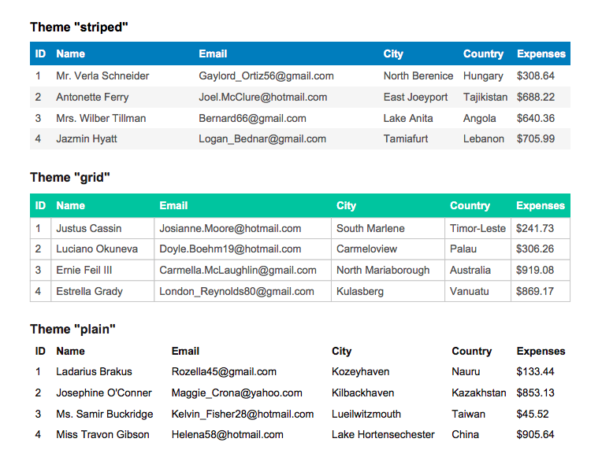

# AutoTable - Table plugin for jsPDF

[](https://gitter.im/simonbengtsson/jsPDF-AutoTable?utm_source=badge&utm_medium=badge&utm_campaign=pr-badge&utm_content=badge)

**Generate PDF tables with javascript**

Check out the [demo](https://simonbengtsson.github.io/jsPDF-AutoTable/) to get an overview of what can be done with this plugin. Example uses include participant tables, start lists, result lists etc.



### Install
Download and include [jspdf.plugin.autotable.js](https://raw.githubusercontent.com/simonbengtsson/jsPDF-AutoTable/master/dist/jspdf.plugin.autotable.js) and [jspdf.min.js](https://raw.githubusercontent.com/MrRio/jsPDF/master/dist/jspdf.min.js).

```html
<script src="bower_components/jspdf/dist/jspdf.min.js"></script>
<script src="bower_components/jspdf-autotable/jspdf.plugin.autotable.js"></script>
```

You can also get the plugin with a package manager:
- `bower install jspdf-autotable`
- `npm install jspdf-autotable` (only client side usage)
- `meteor add jspdf:autotable`

It is also available on cdnjs:
```html
<script src="https://cdnjs.cloudflare.com/ajax/libs/jspdf-autotable/2.0.16/jspdf.plugin.autotable.js"></script>
```

### Usage

```javascript
var columns = ["ID", "Name", "Country"];
var rows = [
    [1, "Shaw", "Tanzania", ...],
    [2, "Nelson", "Kazakhstan", ...],
    [3, "Garcia", "Madagascar", ...],
    ...
];

// Only pt supported (not mm or in)
var doc = new jsPDF('p', 'pt');
doc.autoTable(columns, rows);
doc.save('table.pdf');
```

### Usage with options

```javascript
var columns = [
    {title: "ID", dataKey: "id"},
    {title: "Name", dataKey: "name"}, 
    {title: "Country", dataKey: "country"}, 
    ...
];
var rows = [
    {"id": 1, "name": "Shaw", "country": "Tanzania", ...},
    {"id": 2, "name": "Nelson", "country": "Kazakhstan", ...},
    {"id": 3, "name": "Garcia", "country": "Madagascar", ...},
    ...
];

// Only pt supported (not mm or in)
var doc = new jsPDF('p', 'pt');
doc.autoTable(columns, rows, {
    styles: {fillColor: [100, 255, 255]},
    columnStyles: {
    	id: {fillColor: 255}
    },
    margin: {top: 60},
    beforePageContent: function(data) {
    	doc.text("Header", 40, 30);
    }
});
doc.save('table.pdf');
```

See other examples in `/examples/examples.js` which is also the source code for the [demo](https://simonbengtsson.github.io/jsPDF-AutoTable/) documents.

### Options
All options below are used in `examples.js` so be sure to check it out if in doubt.

```javascript
{
    // Styling
    theme: 'striped', // 'striped', 'grid' or 'plain'
    styles: {},
    headerStyles: {},
    bodyStyles: {},
    alternateRowStyles: {},
    columnStyles: {},

    // Properties
    startY: false, // false (indicates margin top value) or a number
    margin: 40, a number, array or object
    pageBreak: 'auto', // 'auto', 'avoid' or 'always'
    tableWidth: 'auto', // 'auto', 'wrap' or a number, 

    // Hooks
    createdHeaderCell: function (cell, data) {},
    createdCell: function (cell, data) {},
    drawHeaderRow: function (row, data) {},
    drawRow: function (row, data) {},
    drawHeaderCell: function (cell, data) {},
    drawCell: function (cell, data) {},
    beforePageContent: function (data) {},
    afterPageContent: function (data) {}
 };
```

### Note on units
Only pt are supported at this stage. The goal is to support all units supported by jspdf including mm and in but currently there is not timeplan for that.

### Styles
Styles work similar to css and can be overriden by more specific styles. The overriding order is as follows: Default styles <- theme styles <- `styles` <- `headerStyles` and `bodyStyles` <- `alternateRowStyles` and `columnStyles`. It is also possible to override specific cell or row styles using for example the `createdCell` hook. Checkout the `Custom style` example for more information.

```javascript
{
	cellPadding: 5,
    fontSize: 10,
    font: "helvetica", // helvetica, times, courier
    lineColor: 200,
    lineWidth: 0.1,
    fontStyle: 'normal', // normal, bold, italic, bolditalic
    overflow: 'ellipsize', // visible, hidden, ellipsize or linebreak
    fillColor: 255,
    textColor: 20,
    halign: 'left', // left, center, right
    valign: 'middle', // top, middle, bottom
    fillStyle: 'F', // 'S', 'F' or 'DF' (stroke, fill or fill then stroke)
    rowHeight: 20,
    columnWidth: 'auto' // 'auto', 'wrap' or a number
}
```
All colors can either be specified as a number (255 white and 0 for black) or an array [red, green, blue].

Every style above can be changed on a cell by cell basis. However to have different rowHeights for cells in the same row or different columnWidths for cells in the same column is unsupported.

Many of the styles has a matching jspdf set method. For example `fillStyle` corresponds to `doc.setFillStyle()`. More information about those can be found in the jspdf documentation.

### Properties
- `startY` Indicates where the table should start to be drawn on the first page (overriding the margin top value). It can be used for example to draw content before the table. Many examples use this option, but the above use case is presented in the `With content` example.
- `margin` Similar to margin in css it sets how much spacing it should be around the table on each page. The startY option can be used if the margin top value should be different on the first page. The margin option accepts both a number, an array [top, right, bottom, left] and an object {top: 40, right: 40, bottom: 40, left: 40}. If you want to use the default value and only change one side you can specify it like this: {top: 60}.
- `pageBreak` This option defines the behavior of the table when it will span more than one page. If set to 'always' each table will always start on a new page. If set to 'avoid' it will start on a new page if there is not enough room to fit the entire table on the current page. If set to 'auto' it will add a new page only when the next row doesn't fit.
- `tableWidth` This option defines the fixed width of the table if set to a number. If set to 'auto' it will be 100% of width of the pageand if set to 'wrap' it will only be as wide as its content is.  

### Hooks
There are 8 different hooks that gets called at various times during the drawing of the table. If applicable, information about the current cell, row or column are provided to the hook function. In addition to that the following general information is alaways provided in the `data` parameter:
- `pageCount` - The number of pages it currently spans
- `settings` - The user options merged with the default options
- `table` - Information about the table such as the rows, columns and dimensions
- `cursor` - The position at which the next table cell will be drawn. This can be assigned new values to create column and row spans. Checkout the Colspan and Rowspan example for more information.

### Helper functions
- `autoTableHtmlToJson(tableElem, includeHiddenRows)` Use it to generate the javascript objects required for this library from an html table (see `from html` example)
- `autoTableEndPosY()` Use it if you want to know where on the page the the last row were drawn (see `multiple tables` example)

### Upgrade to Version 2.0 from 1.x
- Use the hooks (or  styles and themes) instead of `renderCell`, `renderHeaderCell`, `renderFooter`and `renderHeader`
- Custom column width now specified with the style columnWidth
- Use `tableWidth` instead of `extendWidth`
- Use `columnWidth: 'wrap'` instead of `overflowColumns` 
- Use `pageBreak` instead of `avoidPageSplit`
- Use `margin` instead of `margins`
- `autoTableHtmlToJson` now always returns an object
- Use `API.autoTableEndPosY()` instead of `API.autoTableEndPos()`
- Use column.x instead of cursor.x

### Other pdf libraries

#### [pdfmake (javascript)](https://github.com/bpampuch/pdfmake)
I much prefer the coding style of jspdf over pdfmake, however the tables features of pdfmake are great.

#### [Included jsPDF table plugin](https://github.com/MrRio/jsPDF/blob/master/jspdf.plugin.cell.js)
No up to date documentation of how to use it (?) and has bugs. You might find it useful however.
 
#### [fpdf (php)](http://www.fpdf.org/) and [pdfbox (java)](https://pdfbox.apache.org/) 
No included table features and have to be used server side.

### Questions and issues
If you have questions regarding how to use this plugin, please post on stackoverflow with the `jspdf-autotable` tag and I will try to answer them. If you think you have found a problem with the plugin feel free to create an issue on Github. However, try to replicate the issue on `codepen` or some similar service first. Here is a [codepen](http://codepen.io/someatoms/pen/EjwPEb) with `jspdf` and `jspdf-autotable` included that you can fork.

### Contributions
Contributions are always welcome, especially on open issues or for items in the future work section below. If you have something major you want to add or change, please post an issue about it first.

- Make your changes in `src/main.js`
- Build dist files with `npm run build`
- Test the examples in examples.html to make sure everything looks alright
- Submit pull request

### Release (write access to repo required)
- Build with `npm version <semver|major|minor|patch> -m <optional-commit-message>`
- Manually check files and look over the examples
- Deploy with `npm run deploy`

### Known issues
- The style `valign: center` gets inexact when using `overflown: linebreak` and there is around five or more rows

### Future work
- Header option `always`, `single`, `none`
- Improve examples page (especially for firefox and mobile browsers that doesn't embed pdfs)
- Easier way to add page numbers
